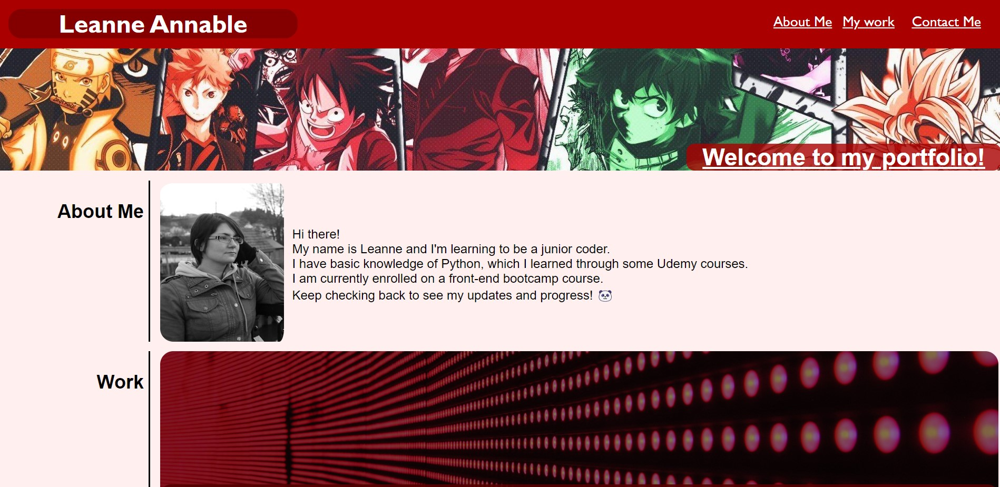
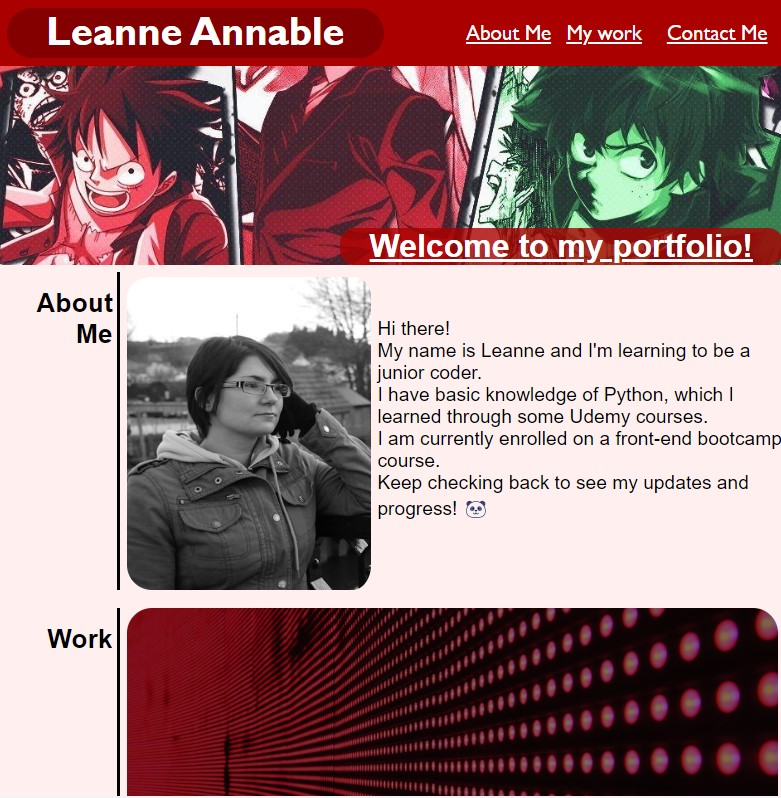
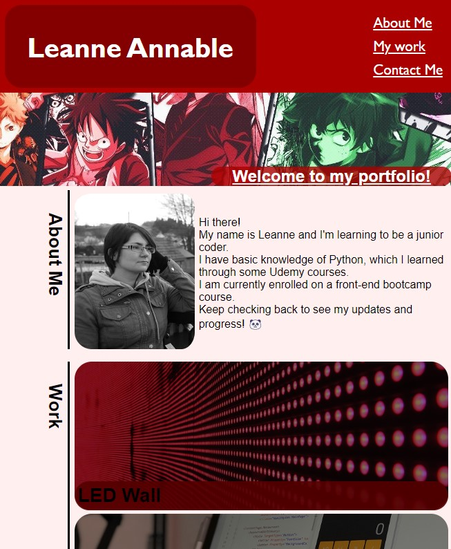

# Your Project Title

## Description 

This website is my starter Portfolio. I will build on it further over time as i create more projects that can be linked. 

I have links at the top which currently take you to three sections, about me, my work projects (currently placeholders to a coming soon website) and a contact me section with working links to my Github and email.

It is currently a simple layout with a few design tweaks to show a bit of my personality, and to allow me to test out some style features.

## Usage 

The portfolio page currently has three links at the top taking you to different areas of the page. It also has links in the contact me section which allow users to email me or look at my other work in Github.

I have attached some screenshots of the top of the webpage in multiple media sizes.

Link to active website: https://Leanne-Annable.github.io/Week-two-challenge/

## Credits

I give credit to a number of tutor/TA and some student links posted in our slack channel, these links helped me find out different style techniques that i tried out on the page.

## License

This webpage is licenced under the MIT Licence

© 2022 edX Boot Camps LLC. Confidential and Proprietary. All Rights Reserved.
